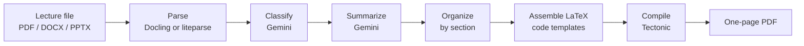

# Cheatsheet Maker

Turn lecture materials into a condensed, one-page LaTeX cheatsheet for exams.

Upload lecture notes or slides, and the app extracts the key definitions, theorems, formulas and examples, shortens the wording while keeping the math intact, and compiles a print-ready PDF based on your format settings.

> **Status: work in progress.** The backend pipeline works end to end. The API layer and the frontend are not built yet. See [Status](#status).

## How it works



1. **Parse.** The lecture file is converted to Markdown, with OCR for scanned pages.
2. **Classify.** Gemini splits the text into typed items (`definition`, `theorem`, `example`, `formula`, `explanation`), each with a section name.
3. **Summarize.** A second Gemini call shortens definitions, examples and explanations. Formulas and theorems are left untouched, and math inside sentences is preserved exactly.
4. **Assemble.** Plain Python code (not an LLM) builds the LaTeX file from the items and the format settings.
5. **Compile.** Tectonic compiles the `.tex` file into a PDF.

## Design decisions

- **The LLM extracts, code writes the LaTeX.** LLMs sometimes produce invalid syntax, so the model only returns structured data. A deterministic assembler generates the LaTeX, which keeps the output compilable.
- **One owner for math delimiters.** `formula` items contain raw math, and the assembler adds the `$...$`. Prose items carry inline `$...$` from the model. Two components adding delimiters caused compile errors earlier.
- **Escaping.** `escape_latex()` sanitizes plain text but skips math segments.
- **Structured output.** Gemini responses are constrained by a Pydantic schema (`ExtractedItem`), so the rest of the pipeline works with typed objects.

## Status

| Component | State |
| --- | --- |
| Document parsing (Docling, with OCR) | Working, but slow |
| Fast parsing alternative (liteparse) | Being evaluated |
| Classification (Gemini) | Working |
| Summarization (Gemini) | In testing |
| LaTeX assembly and PDF compile | Working, still being polished |
| Format settings (font size, columns, orientation, margin) | Working |
| Retry handling, quota handling and caching for LLM calls | Planned |
| Content settings (choose which sections and items to include) | Planned |
| FastAPI backend (async job: submit, then poll status) | Planned |
| React frontend | Planned |

## Tech stack

| Tool | Why it's used |
| --- | --- |
| Python | Pipeline language, and the ecosystem for document parsing and LLMs |
| [Docling](https://github.com/docling-project/docling) | Layout-aware parsing of PDF, DOCX and PPTX, with OCR |
| [liteparse](https://github.com/run-llama/liteparse) | Fast, rule-based parsing, evaluated as a quick mode |
| [Gemini API](https://ai.google.dev/gemini-api/docs) | Classification and summarization, with structured JSON output |
| Pydantic | Schemas for LLM output and format settings |
| [Tectonic](https://tectonic-typesetting.github.io) | Self-contained LaTeX engine, easy to call from code |
| FastAPI and React (planned) | Async job API and web frontend |

## Getting started

### Prerequisites

- Python 3.10 or newer
- [Tectonic](https://tectonic-typesetting.github.io) installed and on your `PATH`
- A [Gemini API key](https://ai.google.dev/gemini-api/docs/api-key). The free tier has small daily quotas, so a full run can use up a large share of them.
- Optional: LibreOffice, if you use liteparse with PPTX or DOCX files

### Install and run

```bash
git clone <your-repo-url>
cd cheatsheet-maker

python -m venv .venv
source .venv/bin/activate
pip install -r requirements.txt

export GEMINI_API_KEY="your-key-here"
```

Set the input file path in `main.py`, then run:

```bash
python main.py
```

The result is written to `output/cheatsheet.pdf`.

## Project structure

```
.
├── main.py                 # runs the pipeline end to end
├── settings.py             # format settings (font size, columns, orientation, margin)
├── parsing/
│   ├── parser.py           # file -> Markdown
│   ├── classifier.py       # Markdown -> typed items (Gemini)
│   └── jsonformat.py       # ExtractedItem and ItemType schemas
├── latex/
│   └── assembler.py        # items -> .tex, escaping, Tectonic compile
└── output/                 # generated .tex and .pdf files
```

## Known limitations

- Formulas extracted from PDFs can be garbled, especially equations from slides. This is the main quality issue.
- A full run takes minutes with Docling, mostly in parsing and OCR.
- Free-tier Gemini quotas are easy to exhaust while testing, and there is no caching yet.
- DOCX and PPTX inputs are not fully tested.

## Roadmap

1. Retry logic for temporary Gemini errors, a clear failure for exhausted daily quotas, and caching of parsed and LLM results.
2. Parser modes: a fast default and a high-quality option for difficult files.
3. Content settings for choosing which sections and item types go on the sheet.
4. FastAPI backend with an async job pattern and progress status.
5. React frontend, hosted separately from the backend.

## License

To be decided.

## Acknowledgements

Built with [Docling](https://github.com/docling-project/docling), [liteparse](https://github.com/run-llama/liteparse), the [Gemini API](https://ai.google.dev/gemini-api/docs) and [Tectonic](https://tectonic-typesetting.github.io).